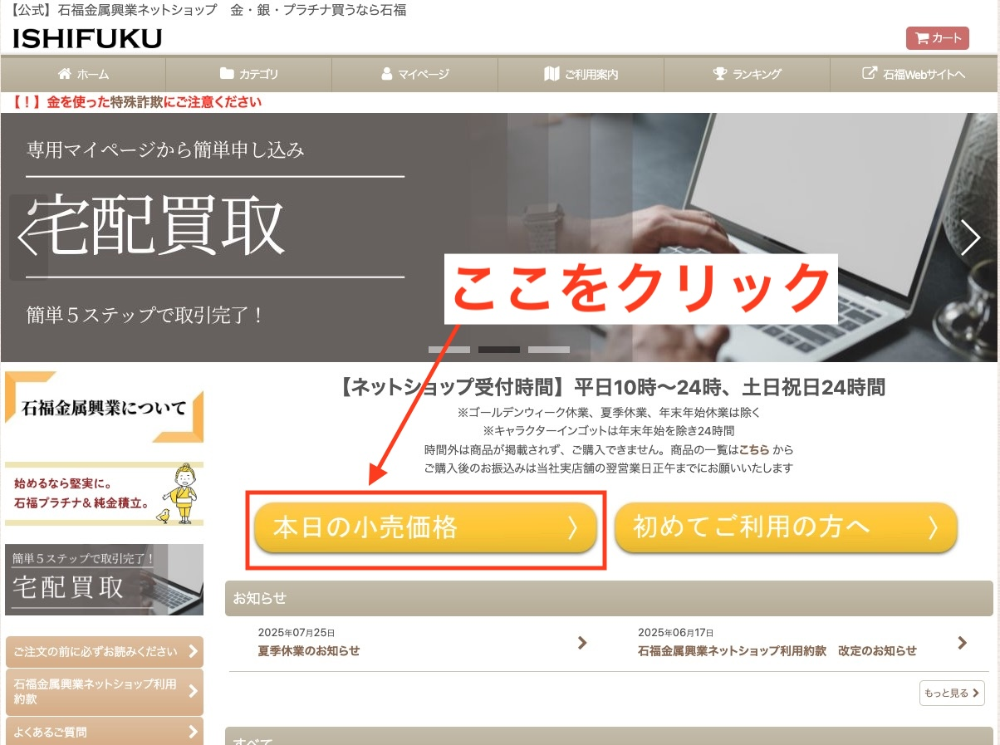
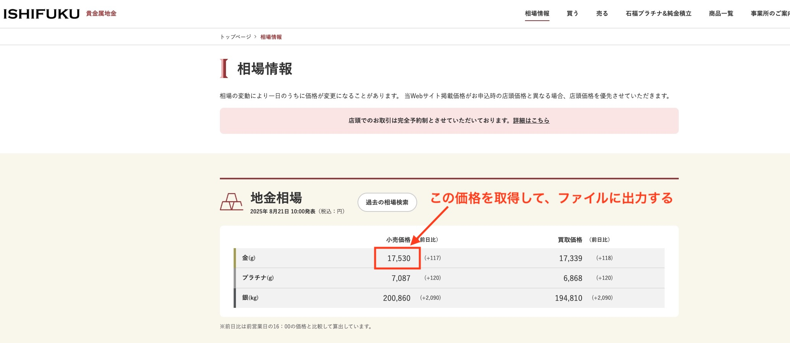

# 役割
あなたは、Pythonによるウェブスクレイピングとデータ処理を専門とする、経験豊富なソフトウェア開発者です。堅牢性、正確性、そして丁寧なエラーハンドリングを最優先事項として、以下のタスクを実行してください。

# 目的
石福金属興業ネットショップの公式サイトから最新の「金」の小売価格を取得し、指定されたフォーマットのCSVファイルに保存するPythonスクリプトを作成する。

# 成果物
1.  **Pythonスクリプト (`scrape_ishifuku.py`):** ウェブスクレイピングとファイル保存のロジックを実装したファイル。
2.  **CSVファイル (`ishihuku-gold-YYYYMMDD.csv`):** 取得したデータを保存するファイル。
3.  **ログファイル (`scraping_error.log`):** エラー発生時に詳細を記録するファイル。

# タスク仕様

### ステップ1: Webページへのアクセスと解析
- ターゲットURL: `https://www.ishifukushop.com/`
- まずトップページにアクセスし、「本日の小売価格」へのリンクを探し、そのページに遷移する。
  - 
- 相場情報ページのHTMLコンテンツを取得し、BeautifulSoupライブラリで解析する。

### ステップ2: 価格データの抽出と整形
- ページ内から「地金相場」セクションを探す。
- テーブルの中から「金(g)」というテキストを含む行（`<tr>`）を特定する。
- その行に含まれる「小売価格」を取得する。これは通常、該当行の3番目のデータセル（`<td>`）に記載されている。
  - 
- **データ整形（最重要）:** 取得した価格データ（例: "17,550"）から、カンマ`,`や空白などの数値以外の文字をすべて除去し、純粋な整数（例: `17550`）に変換する。

### ステップ3: 日時情報の取得
- スクリプト実行時の現在の日付 (`YYYY-MM-DD`形式) を取得する。
- スクリプト実行時の現在の日時 (`YYYY-MM-DD HH:MI:SS`形式) を取得する。

### ステップ4: CSVファイルへの出力
- **ファイル名:** `ishihuku-gold-yyyymmdd.csv` とする。`yyyymmdd` の部分は、ステップ3で取得した日付を元に動的に生成する（例: `ishihuku-gold-20250821.csv`）。
- **ファイル形式:**
    - 文字コード: `UTF-8`
    - ヘッダーなし
    - 項目をカンマ区切りで一行に出力する。
- **項目と順序:**
    1. 日付 (`YYYY-MM-DD`)
    2. 金の小売価格（整数）
    3. 取得日時 (`YYYY-MM-DD HH:MI:SS`)
- **出力サンプル:** `2025-08-21,17550,2025-08-21 10:25:48`

# エラーハンドリング仕様
- 以下のエラーが発生した場合は、例外を捕捉し、指定された処理を行うこと。
  - ネットワークエラー（サイトに接続できない等）
  - HTML構造の変更（価格情報が指定の場所に見つからない等）
- **エラー発生時の処理:**
  1. **ロギング:** `scraping_error.log` というファイルに、エラーが発生した日時とエラー内容（例外情報）を追記モードで記録する。
  2. **空ファイルの作成:** `ishihuku-gold-yyyymmdd.csv` という名前で、中身が完全に空のファイルを作成する。データは一切書き込まない。
  3. **正常終了:** スクリプトはエラー終了せず、正常に（終了コード0で）終了させる。

# 最終指示
- 上記のすべての要件を満たす、完全なPythonスクリプトを生成してください。
- スクリプトには、各処理の内容が理解しやすいように適切なコメントを付与してください。
- 必要なライブラリ（`requests`, `beautifulsoup4`）も明記してください。