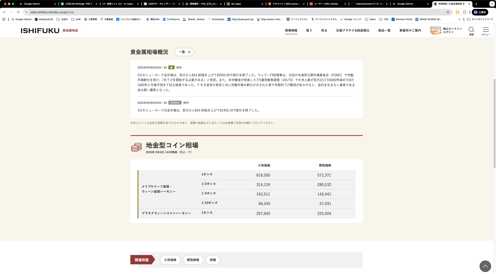

## Webスクレイピング機能改修 作業指示書（CSV出力版）

### 1. 概要

現在運用している地金価格取得スクリプトに、新たに地金型コインの価格情報を追加取得する改修を依頼します。また、アウトプット形式を既存のフォーマットから、商品名を含む新しいCSVフォーマットに変更します。

### 2. 背景・目的

市場分析のため、現在取得している金の地金価格に加え、主要な金貨の小売価格も併せて取得し、データとして蓄積する必要が出てきました。本改修により、分析対象のデータを拡充することを目的とします。

### 3. 現状の仕様

  - **使用技術**: Python, Selenium, Playwright
  - **対象URL**: `https://retail.ishifuku-kinzoku.co.jp/price/`
  - **現取得項目**:
      - 「地金相場」セクション
          - 「金」の「小売価格（税込）」

### 4. 改修要件（追加取得項目）

既存の取得項目に加えて、以下の項目を**すべて**追加で取得できるようにしてください。

  - **対象セクション**: 「地金型コイン相場」
  - **対象項目**:
      - **メイプルリーフ金貨・ウィーン金貨ハーモニー**
          - 1オンス の「小売価格（税込）」
          - 1/2オンス の「小売価格（税込）」
          - 1/4オンス の「小売価格（税込）」
          - 1/10オンス の「小売価格（税込）」

### 5. 実装上のヒント

  - HTMLから要素を取得する際は、既存の処理を最大限に有効活用すること
  - 各コインの価格はテーブル内に記述されています。コインの種類とサイズ（例: `メイプルリーフ金貨 1オンス`）をキーとして、対応する行の「小売価格」を取得するロジックが効率的です。
  - 以下の例は、XPathを利用して要素を取得する場合の一例です。

**メイプルリーフ金貨 1オンスの小売価格を取得するXPathの例:**

```xpath
//th[contains(text(), 'メイプルリーフ金貨 1オンス')]/following-sibling::td[1]
```

※ `following-sibling::td[1]` は「小売価格」のセルを指します。サイトの構造変更によりインデックスが変わる可能性がある点にご留意ください。

### 6. 期待するアウトプット（CSV形式）

改修後のスクリプトが実行された際に、取得した全項目（金＋コイン4種）のデータを、**1商品1行**の形式でCSVファイルに出力してください。ファイルが既に存在する場合は、**末尾に追記**する仕様とします。

  - **ファイル名**: `ishihuku-price-yyyymmdd.csv`

  - **文字コード**: `UTF-8`

  - **ヘッダー行**: 不要です。

  - **各列のフォーマット**:

      - **当日日付**: `yyyy-mm-dd` 形式（プログラム実行日付）
      - **商品名**: 以下のいずれかの文字列
          - `金`
          - `メイプルリーフ金貨・ウィーン金貨ハーモニー(1oz)`
          - `メイプルリーフ金貨・ウィーン金貨ハーモニー(1/2oz)`
          - `メイプルリーフ金貨・ウィーン金貨ハーモニー(1/4oz)`
          - `メイプルリーフ金貨・ウィーン金貨ハーモニー(1/10oz)`
      - **小売価格**: 数値のみ（既存処理に従うこと）
      - **データ取得日時**: `yyyy-mm-dd hh:mi:ss` 形式（スクリプト実行時の日時）

  - **CSV出力例**:

```csv
当日日付,商品名,小売価格,データ取得日時
2025-09-04,金,15000,2025-09-04 15:30:01
2025-09-04,メイプルリーフ金貨(1oz),350000,2025-09-04 15:30:01
2025-09-04,メイプルリーフ金貨(1/2oz),180000,2025-09-04 15:30:01
2025-09-04,メイプルリーフ金貨(1/4oz),95000,2025-09-04 15:30:01
2025-09-04,メイプルリーフ金貨(1/10oz),40000,2025-09-04 15:30:01
2025-09-04,ウィーン金貨ハーモニー(1oz),349000,2025-09-04 15:30:01
2025-09-04,ウィーン金貨ハーモニー(1/2oz),179000,2025-09-04 15:30:01
2025-09-04,ウィーン金貨ハーモニー(1/4oz),94000,2025-09-04 15:30:01
2025-09-04,ウィーン金貨ハーモニー(1/10oz),39000,2025-09-04 15:30:01
```

※上記の値はダミーです。

### 7. 成果物

  - 上記の改修要件を反映したPythonスクリプトファイル（`.py`）

### 8. その他

  - サイトの構造変更などにより、特定の項目が取得できなかった場合に備え、エラーハンドリングを適切に実装してください。（例: エラーログを出力し、処理を継続する等）
  - コードには、どの部分が何を取得しているのかが分かるように、適度なコメントを追記してください。

### 9. 取得対象画面イメージ

-----